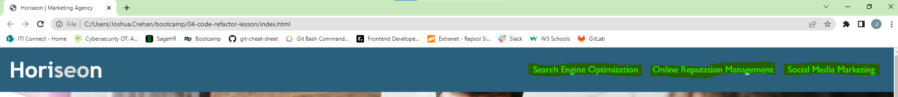

# 04-code-refactor-lesson


## Description
A challenge of an on-the-job ticket to refactor existing code for a marketing agency website to improve the accessibility of their site.
Web accessibility ensures people with disabilities can access a website using assistive technologies such as video captions, screen readers, and braille keyboards.

This was achieved in this project by:
•	including semantic HTML tags throughout the source code
•	ensuring all HTML elements follow a logical structure that is independent of styling and positioning
•	including alt attributes for informative images and icons
•	following a sequential order for all headings


## Table of Contents
- [Installation](#installation)
- [Usage](#Usage)
- [Credits](#Credits)
- [License](#License)


## Installation
N/A


## Usage
Use the navigation links, highlighted in image "Navigation links", to jump to the respective section in the main content of web page. 

```md

```


## Credits
N/A


## License
Please refer to the LICENSE in the repo.

